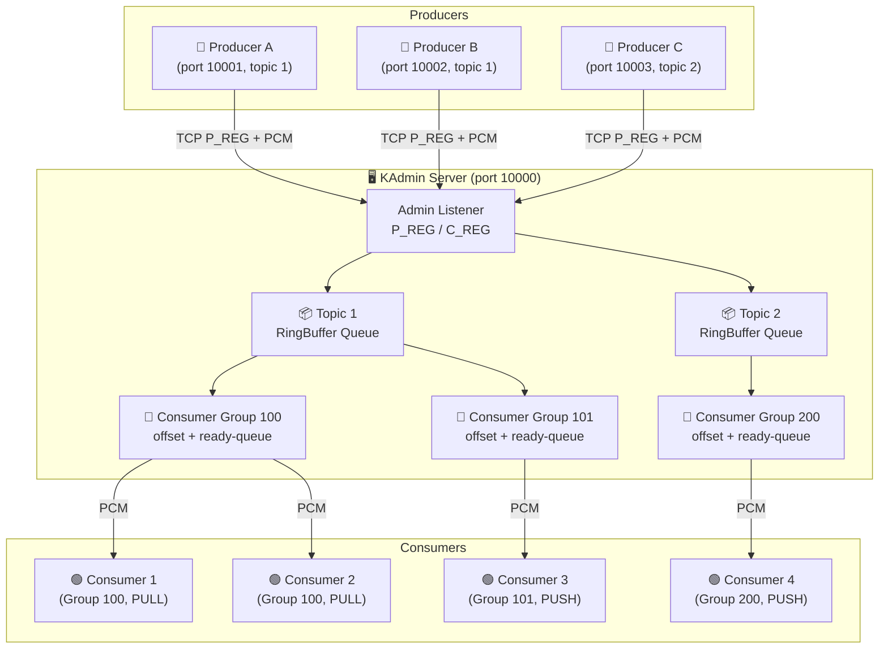
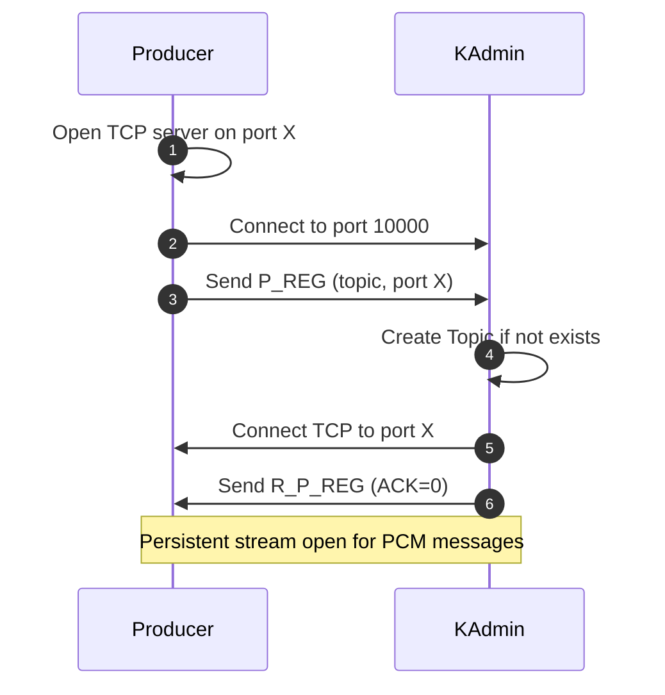
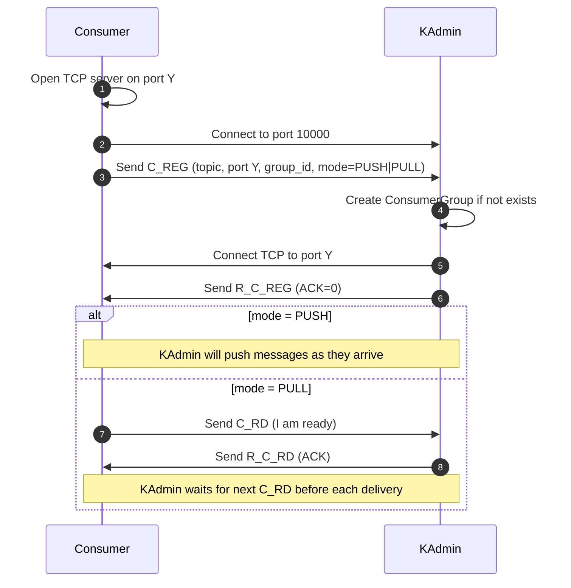
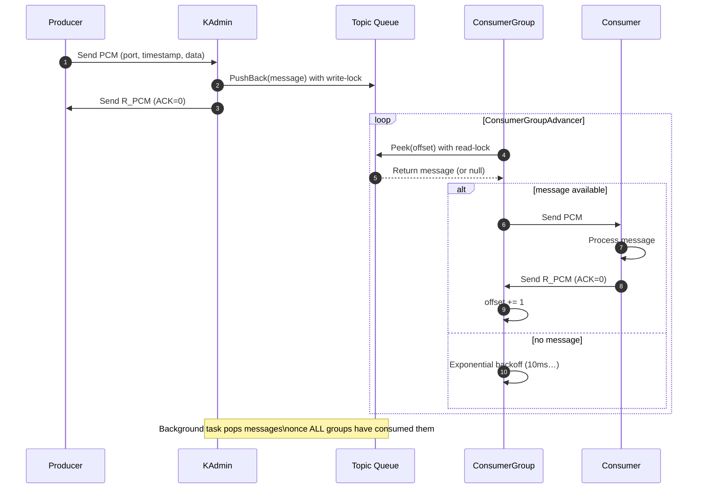
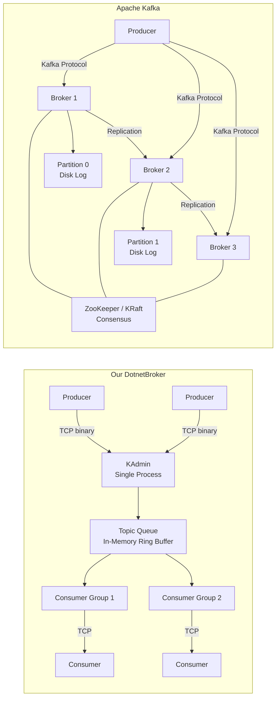

# DotnetBroker — A Kafka-like Message Broker in C# / .NET 9

## 1. Project Overview

Build a **distributed message queue** from scratch in C# / .NET 9, modeled after the concepts in the [Kafka in Zig](file:///d:/TAI/Code/message%20broker/Kafka%20in%20Zig.md) tutorial. The goal is to understand message broker internals while producing a working, tested, benchmarked system — then compare it against the real Apache Kafka.

---

## 1.1 Architecture Overview



> Each **Topic** is an independent in-memory ring-buffer queue.  
> Each **Consumer Group** tracks its own read offset, independent of other groups.  
> Consumers can choose **Push** (server pushes immediately) or **Pull** (consumer signals ready first).

---

## 1.2 Core Features

| # | Feature | Description |
|---|---|---|
| 1 | **Topics** | Named channels; producers publish to a topic, consumers subscribe by topic |
| 2 | **Consumer Groups** | Multiple independent groups each get their own copy of every message |
| 3 | **Offset Tracking** | Per-group absolute offset; messages are only garbage-collected when all groups have consumed them |
| 4 | **Push Mode** | Server immediately pushes the next message to any available consumer — lowest latency |
| 5 | **Pull Mode** | Consumer signals readiness (`C_RD`); server only delivers when the consumer is ready — prevents overload |
| 6 | **Exponential Backoff** | Pull-mode consumers waiting for new messages use 10ms → 20ms → 40ms … backoff to avoid busy-looping |
| 7 | **Multi-Producer Fan-In** | Multiple producers can publish to the same topic simultaneously |
| 8 | **Ring-Buffer Queue** | Fixed-capacity O(1) push/pop with `ReaderWriterLockSlim` for concurrent access |
| 9 | **Persistence (Phase 7)** | State snapshot (JSON) + per-CG offset journal + message WAL for crash recovery |
| 10 | **Binary Wire Protocol** | Compact 1-byte-length-framed binary protocol; each message type has a fixed layout |

---

## 1.3 Main Workflows

### Workflow A — Producer Registration


### Workflow B — Consumer Registration (with mode choice)


### Workflow C — End-to-End Message Flow


---

## 2. How This Project Differs from Apache Kafka

### 2.1 Architecture Comparison



### 2.2 Feature-by-Feature Differences

| Feature | Apache Kafka | Our DotnetBroker |
|---|---|---|
| **Architecture** | Distributed cluster of brokers (3+ nodes typical) | Single `KAdmin` process (centralized) |
| **Consensus** | ZooKeeper or KRaft (Raft-based) for leader election | None — single point of failure |
| **Partitioning** | Topics split into N partitions, each an ordered log | No partitions — single queue per topic |
| **Storage** | Append-only log on disk, segment files, compaction | In-memory ring buffer (persistence as future phase) |
| **Replication** | ISR (In-Sync Replicas) across brokers, configurable replication factor | No replication |
| **Delivery guarantee** | Configurable: at-most-once, at-least-once, exactly-once (with transactions) | At-most-once only |
| **Message format** | RecordBatch with headers, key, value, timestamps, compression | Simple binary: length + type + payload |
| **Consumer offsets** | Stored in internal `__consumer_offsets` topic | In-memory offset per consumer group |
| **Consumer rebalancing** | Automatic partition reassignment via Group Coordinator | Manual — fixed consumer-to-group assignment |
| **Backpressure** | Producers block or get errors when broker is overloaded | Ring buffer panics on overflow |
| **Compression** | gzip, snappy, lz4, zstd | None |
| **Authentication** | SASL (PLAIN, SCRAM, GSSAPI, OAUTHBEARER) | None |
| **Authorization** | ACL-based per topic/group/cluster | None |
| **Wire protocol** | Kafka Protocol (versioned request/response, 60+ API keys) | Custom binary protocol (~8 message types) |
| **Client ecosystem** | Official clients for Java, Python, Go, C/C++, .NET (Confluent) | CLI-only producer/consumer |
| **Monitoring** | JMX metrics, Prometheus exporters | Debug print / simple logging |
| **Throughput** | Millions of msg/sec per broker | Target: thousands of msg/sec (educational) |
| **Maturity** | 12+ years, battle-tested at LinkedIn, Netflix, Uber | Educational project |

### 2.3 What We Intentionally Skip (and Why)

| Kafka Feature | Why We Skip It |
|---|---|
| **Partitioning** | Adds routing complexity; single queue is simpler to reason about |
| **Multi-broker replication** | Requires consensus protocol (Raft/Paxos); massive scope increase |
| **Exactly-once semantics** | Requires transaction coordinator, idempotent producers; very complex |
| **Schema registry** | Out of scope — message is opaque bytes |
| **Kafka Connect / Kafka Streams** | Data integration and stream processing frameworks; separate projects entirely |

### 2.4 What We Add Beyond the Zig Version

| Feature | Details |
|---|---|
| **Async/await everywhere** | Idiomatic C# — no manual thread spawning for I/O |
| **System.IO.Pipelines** | High-perf zero-copy buffer management (matches Zig's `io_uring` intent) |
| **Structured binary protocol** | `BinaryPrimitives` for endian-safe serialization |
| **Full test suite** | Unit + integration + benchmarks (Zig version has none) |
| **BenchmarkDotNet comparison** | Quantified Zig vs C# performance |
| **Documentation** | Architecture docs, protocol spec, getting-started guide |

---

## 3. Technology Stack

| Category | Technology | Why |
|---|---|---|
| **Runtime** | .NET 9 | Latest features, best perf |
| **Language** | C# 13 | Records, pattern matching, raw string literals |
| **TCP Networking** | `System.Net.Sockets.TcpListener` / `TcpClient` | Direct TCP, mirrors Zig approach |
| **High-perf I/O** | `System.IO.Pipelines` | Zero-copy buffer mgmt, backpressure built-in |
| **Binary serialization** | `System.Buffers.Binary.BinaryPrimitives` | Endian-safe, allocation-free |
| **Concurrency** | `async/await`, `Channel<T>`, `ReaderWriterLockSlim` | Idiomatic C# concurrency |
| **Testing** | xUnit + FluentAssertions | Industry standard for .NET |
| **Benchmarking** | BenchmarkDotNet | Statistically rigorous .NET benchmarks |
| **State persistence** | `System.Text.Json` + `FileStream` | Simple and built-in |
| **Build** | `dotnet` CLI | Standard .NET toolchain |

---

## 4. Project Structure

```
d:\TAI\Code\message broker\DotnetBroker\
│
├── DotnetBroker.sln
│
├── src\
│   ├── DotnetBroker.Core\                # Shared library
│   │   ├── Protocol\
│   │   │   ├── MessageType.cs            # Byte enum for all message types
│   │   │   ├── BrokerMessage.cs          # Parse/serialize any message
│   │   │   ├── ProducerRegisterPayload.cs
│   │   │   ├── ConsumerRegisterPayload.cs
│   │   │   ├── ProduceConsumePayload.cs
│   │   │   └── StreamExtensions.cs       # ReadMessageAsync / WriteMessageAsync
│   │   ├── Queue\
│   │   │   └── RingBufferQueue.cs        # Generic ring buffer (from Zig)
│   │   └── Models\
│   │       ├── Topic.cs                  # Topic ID + message queue + CG list
│   │       └── ConsumerGroup.cs          # Group ID + consumer list + offset
│   │
│   ├── DotnetBroker.Server\             # KAdmin — the broker server
│   │   ├── Program.cs                   # Entry point, CLI parsing
│   │   ├── BrokerServer.cs              # Accept admin commands, manage state
│   │   ├── ProducerHandler.cs           # Read PCM from a producer stream
│   │   ├── ConsumerGroupAdvancer.cs     # Deliver messages to consumers
│   │   └── PersistenceManager.cs        # Snapshot + journal (Phase 7)
│   │
│   ├── DotnetBroker.Producer\           # Producer process
│   │   ├── Program.cs
│   │   └── ProducerClient.cs            # Register + send messages
│   │
│   └── DotnetBroker.Consumer\           # Consumer process
│       ├── Program.cs
│       └── ConsumerClient.cs            # Register + receive messages
│
├── tests\
│   ├── DotnetBroker.UnitTests\
│   │   ├── RingBufferQueueTests.cs
│   │   ├── BrokerMessageSerializationTests.cs
│   │   └── TopicAndConsumerGroupTests.cs
│   │
│   ├── DotnetBroker.IntegrationTests\
│   │   ├── EchoFlowTests.cs
│   │   ├── SingleProducerSingleConsumerTests.cs
│   │   ├── MultiConsumerGroupReplicationTests.cs
│   │   └── PullModelTests.cs
│   │
│   └── DotnetBroker.Benchmarks\
│       ├── Program.cs
│       ├── ThroughputBenchmark.cs
│       └── LatencyBenchmark.cs
│
├── docs\
│   ├── architecture.md
│   ├── protocol.md
│   ├── getting_started.md
│   └── performance_comparison.md
│
└── README.md
```

---

## 5. Implementation Phases

### Phase 1: TCP Echo (Week 1)
**Goal**: Prove TCP communication works end-to-end.

- [ ] Create solution + 4 projects (Core, Server, Producer, Consumer)
- [ ] Implement `StreamExtensions.ReadMessageAsync` / `WriteMessageAsync` with 1-byte length framing
- [ ] Server: `TcpListener` on port, accept connection, read message, echo back
- [ ] Client: connect, send stdin line, print response
- [ ] Support multiple concurrent connections via `Task.Run`

**Files**: `StreamExtensions.cs`, `BrokerServer.cs` (echo mode), `Program.cs` (server + client)

---

### Phase 2: Admin Server & Binary Protocol (Week 1–2)
**Goal**: Structured message protocol with typed commands.

- [ ] Define `MessageType` enum: `Echo=1`, `P_REG=2`, `R_ECHO=101`, `R_P_REG=102`
- [ ] `BrokerMessage`: static methods `Serialize(MessageType, ReadOnlySpan<byte>)` → `byte[]` and `Deserialize(byte[])` → `(MessageType, byte[])`
- [ ] `ProducerRegisterPayload`: topic (uint32, big-endian) + port (uint16, big-endian)
- [ ] Server processes `P_REG`: stores producer port+topic, connects back to producer TCP server
- [ ] Producer: opens own TCP server → sends `P_REG` to admin → accepts admin connection → bidirectional stream ready

**Key design**: Use `BinaryPrimitives.ReadUInt32BigEndian` / `WriteUInt32BigEndian` for cross-platform byte order.

---

### Phase 3: Topics, Consumer Groups, Queue (Week 2)
**Goal**: Core data structures for message routing.

- [ ] `RingBufferQueue<T>`: generic ring buffer with configurable capacity
  - `PushBack(T item)`, `PopFront() → T?`, `Peek(int offset) → T?`
  - Track `PopCount` to support absolute offsets
  - Thread-safe via `ReaderWriterLockSlim`
- [ ] `Topic`: TopicId (uint), `RingBufferQueue<ProduceConsumePayload>`, `List<ConsumerGroup>`, offsets per CG
- [ ] `ConsumerGroup`: GroupId (uint), consumer streams + state, ready-queue
- [ ] `C_REG` message: topic (u32) + port (u16) + group_id (u32)
- [ ] Server processes `C_REG`: create CG if needed, connect to consumer, store stream

---

### Phase 4: Blocking Message Delivery (Week 2–3)
**Goal**: End-to-end message flow from producer to consumer.

- [ ] `ProduceConsumePayload`: producer_port (u16) + timestamp (u64) + message (byte[])
- [ ] `PCM` and `R_PCM` message types
- [ ] `ProducerHandler`: background task reads PCM from producer stream, pushes to topic queue
- [ ] `ConsumerGroupAdvancer`: background task per CG, peeks queue at CG offset, writes PCM to a consumer, waits ACK, advances offset
- [ ] Background queue popper: periodically finds min offset across all CGs, pops consumed messages
- [ ] Consumer process: loops receiving PCM messages, prints to stdout, sends ACK

**Test**: 1 producer → 2 consumer groups → verify both receive the same messages.

---

### Phase 5: Delivery Modes (Push vs. Pull) & Concurrency (Week 3)
**Goal**: Efficient, configurable message delivery patterns.

- [ ] **Configurable Mode**: Update consumer registration to choose between **Push** (server-driven) and **Pull** (client-driven).
- [ ] **Push Logic**: Server delivers messages immediately upon arrival at topic queue (low latency).
- [ ] **Pull Logic**:
  - `C_RD` (consumer ready) message type — consumer signals readiness.
  - `R_C_RD` (ready ACK) from server.
  - Consumer sends `C_RD` → server puts consumer in CG ready-queue (`Channel<int>`).
  - `ConsumerGroupAdvancer` dequeues from ready-queue, sends PCM, on ACK re-enqueues.
- [ ] **Backoff**: Exponential backoff when consumer is faster than producer (`Task.Delay` doubling from 10ms).
- [ ] **Cv Feature**: This demonstrates an understanding of the trade-off between **Latency** (Push) vs **Reliability/Backpressure** (Pull).

**Test**: Compare latency and CG throughput between Push vs Pull modes under heavy load.

---

### Phase 6: Async I/O & Performance (Week 3–4)
**Goal**: Replace blocking I/O with high-performance async.

- [ ] Migrate all stream reads to `PipeReader` / `PipeWriter` via `System.IO.Pipelines`
- [ ] Use `ReadOnlySequence<byte>` for zero-copy message parsing
- [ ] Non-blocking writes with fire-and-forget tasks
- [ ] Connection pooling: reuse `NetworkStream` across multiple messages
- [ ] `ValueTask` for hot paths to reduce allocations

---

### Phase 7: Persistence (Week 4)
**Goal**: Survive server restart.

- [ ] **State snapshot**: JSON file with topics + consumer group IDs
  ```json
  {
    "topics": [
      { "topic_id": 1, "cgroup_ids": [100, 101] }
    ]
  }
  ```
- [ ] **Offset journal**: append-only binary file per CG (`cg_offset_{id}.bin`), each entry = 4 bytes (uint32 offset)
- [ ] **Message log** (optional): append-only file per topic
- [ ] **Recovery**: on startup, read snapshot → rebuild topics/CGs → replay offset journals → set correct positions
- [ ] Producer/consumer re-register after server restart (client-side retry loop)

---

### Phase 8: Documentation & Benchmarks (Week 4–5)
**Goal**: Complete docs and performance numbers.

- [ ] `docs/architecture.md` — system diagram, data flow, component responsibilities
- [ ] `docs/protocol.md` — wire format spec with byte-level diagrams
- [ ] `docs/getting_started.md` — prerequisites, build, run, expected output
- [ ] `docs/performance_comparison.md` — methodology + results
- [ ] `README.md` — overview, quick start, links to docs

---

## 6. Wire Protocol Specification

### Message Frame

```
┌──────────┬──────────────┬─────────────────────┐
│ Length(1) │ Type(1)      │ Payload(0..253)     │
│ uint8    │ MessageType  │ varies              │
└──────────┴──────────────┴─────────────────────┘
```

- **Length** = total bytes of `Type` + `Payload` (max 254)
- **Type** = `MessageType` enum value

### Message Types

| Code | Name | Direction | Payload |
|------|------|-----------|---------|
| 1 | `ECHO` | Client→Server | UTF-8 string |
| 2 | `P_REG` | Producer→Admin | `topic:u32` + `port:u16` (6 bytes, big-endian) |
| 3 | `C_REG` | Consumer→Admin | `topic:u32` + `port:u16` + `group_id:u32` + `mode:u8` (0=Push, 1=Pull) (11 bytes) |
| 4 | `PCM` | Producer→Admin→Consumer | `producer_port:u16` + `timestamp:u64` + `message:byte[]` |
| 5 | `C_RD` | Consumer→Admin | 1 byte (ready signal) |
| 101 | `R_ECHO` | Server→Client | UTF-8 string |
| 102 | `R_P_REG` | Admin→Producer | 1 byte ACK (0=ok, 1=error) |
| 103 | `R_C_REG` | Admin→Consumer | 1 byte ACK |
| 104 | `R_PCM` | Consumer→Admin | 1 byte ACK |
| 105 | `R_C_RD` | Admin→Consumer | 1 byte ACK |

---

## 7. Testing Strategy

### 7.1 Unit Tests

```
dotnet test --filter "FullyQualifiedName~UnitTests"
```

| Test | Purpose |
|---|---|
| `RingBufferQueue_PushPop` | Push N items, pop N items, verify order |
| `RingBufferQueue_Wraparound` | Fill buffer, pop half, push more, verify wrap |
| `RingBufferQueue_PeekWithOffset` | Peek at absolute offset after pops |
| `BrokerMessage_RoundTrip_AllTypes` | Serialize then deserialize every message type |
| `Topic_AddMessage_AddCGroup` | Add messages, add CGs, verify offsets |

### 7.2 Integration Tests

```
dotnet test --filter "FullyQualifiedName~IntegrationTests"
```

| Test | Purpose |
|---|---|
| `Echo_SendAndReceive` | Full TCP echo roundtrip |
| `Producer_Register_And_SendPCM` | Producer registers, sends PCM, admin receives |
| `Consumer_Register_And_ReceivePCM` | Full flow: P→Admin→C |
| `MultiCG_Replication` | 1 producer, 2 CGs, both receive same messages |
| `PullModel_ReadyQueue` | Consumer sends ready, gets message only when ready |

### 7.3 Benchmarks

```
dotnet run -c Release --project tests/DotnetBroker.Benchmarks
```

| Benchmark | What It Measures |
|---|---|
| `Throughput_1P_1C` | Msgs/sec, 1 producer, 1 consumer, 1 CG |
| `Throughput_1P_NC` | Msgs/sec, 1 producer, N consumers across M CGs |
| `Throughput_NP_NC` | Msgs/sec, N producers, N consumers |
| `Latency_P50_P99` | Delivery latency percentiles via timestamp diff |
| `RingBuffer_PushPop` | Raw queue ops/sec (no network) |

---

## 8. Performance Comparison: Zig vs C# vs Kafka

### Methodology

| Metric | Zig (how) | C# (how) | Apache Kafka (how) |
|---|---|---|---|
| **Throughput** | `perf stat` + custom timer | BenchmarkDotNet | `kafka-producer-perf-test.sh` |
| **Latency** | Timestamp diff in PCM | Timestamp diff in PCM | End-to-end latency tool |
| **Memory** | Zig allocator stats / Valgrind | `dotnet-counters` (GC heap, working set) | JMX `jvm.memory` |
| **CPU** | `perf record` + `perf report` | `dotnet-trace` | `perf` or `async-profiler` |

### Expected Outcomes

| Aspect | Expected Winner | Why |
|---|---|---|
| **Raw throughput** | Zig | No GC, manual memory, `io_uring` |
| **Latency consistency** | Zig | No GC pauses |
| **Developer productivity** | C# | `async/await`, rich stdlib, NuGet |
| **Memory usage** | Zig | Manual allocation, no runtime overhead |
| **Feature completeness** | Apache Kafka | 12+ years of production hardening |
| **Ease of deployment** | C# | Single `dotnet publish` binary, cross-platform |

---

## 9. Risk & Mitigation

| Risk | Mitigation |
|---|---|
| Single-process KAdmin is a bottleneck | Profile early with BenchmarkDotNet; optimize hot paths with Pipelines |
| Ring buffer overflow under load | Implement backpressure: producer gets error when queue is 90% full |
| No persistence = data loss | Phase 7 adds snapshot + journal; test recovery in integration tests |
| Message size limited to 253 bytes | Phase 8+: switch to 4-byte length prefix (future improvement) |
| Thread contention on topic queue | `ReaderWriterLockSlim` allows concurrent reads; profile lock contention |

---

## 10. Timeline Summary

| Week | Phase | Deliverable |
|---|---|---|
| 1 | Phase 1–2 | TCP echo + admin protocol working |
| 2 | Phase 3–4 | Full producer → consumer message flow |
| 3 | Phase 5–6 | Pull model + async I/O |
| 4 | Phase 7 | Persistence + recovery |
| 4–5 | Phase 8 | Docs + benchmarks + Zig vs C# comparison report |
