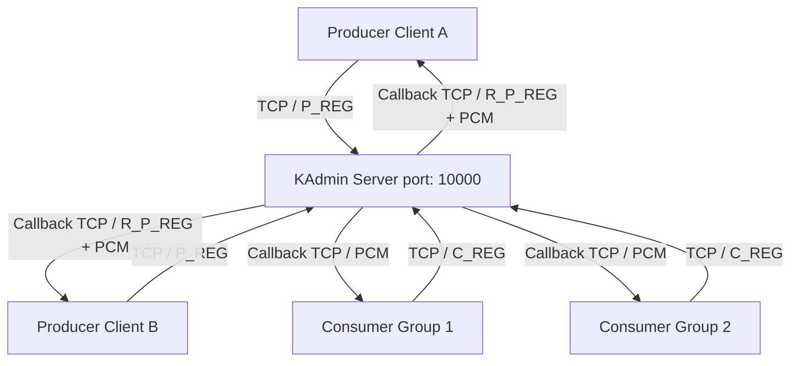

# VortexMQ


**VortexMQ** (coded internally as *DotnetBroker*) is a high-performance, distributed message broker built entirely from scratch in C# / .NET 8. Inspired by the architectural principles of Apache Kafka, this project serves as a comprehensive educational reference for building robust distributed systems, understanding wire protocols, and mastering high-concurrency .NET programming.

While designed for educational purposes, DotnetBroker implements enterprise-grade patterns including custom binary framing, zero-allocation serialization, ring-buffer event queues, and lock-free concurrency models.

---

## 🌟 Key Features

*   **Custom Binary TCP Protocol**: A lightweight, length-framed binary protocol using `System.Buffers.Binary.BinaryPrimitives` for near-zero allocation serialization.
*   **Kafka-Style Topic Routing**: Organizes streams into Topics with multiple independent Consumer Groups.
*   **Flexible Delivery Semantics**: 
    *   **Push Mode**: The broker pushes messages immediately for ultra-low latency.
    *   **Pull Mode**: Consumers signal readiness (`C_RD`), establishing robust backpressure.
*   **High-Concurrency Ring Buffer**: An O(1) fixed-capacity `RingBufferQueue<T>` utilizing `ReaderWriterLockSlim` to enable multiple consumer groups to peek concurrently without locking the producer.
*   **Offset-Based Tracking**: Consumer groups track independent read offsets, allowing fan-out and replayability.
*   **Resilient Persistence**: A hybrid persistence model combining JSON snapshots for topology and binary offset journals for crash recovery.
*   **Exponential Backoff**: Intelligent polling mechanisms that scale back idle CPU consumption automatically.

---

## 🏛️ Architecture & Component Interaction

DotnetBroker is built around a centralized hub (`BrokerServer` / KAdmin) that orchestrates TCP connections from external Producers and Consumers.

### High-Level Topology



### Core Components

1.  **BrokerServer (KAdmin)**: The central server listening on port 10000. It accepts `P_REG` (Producer Registration) and `C_REG` (Consumer Registration) commands. Crucially, KAdmin establishes **reverse TCP callback connections** to the clients to push data asynchronously.
2.  **Topic & RingBufferQueue**: Each `Topic` contains a `RingBufferQueue<ProduceConsumePayload>`. This queue holds messages sequentially. It is bounded (e.g., 10,000 capacity) and implements thread-safe `PushBack` and absolute-offset `TryPeek` operations.
3.  **ProducerHandler**: A dedicated background task spawned per producer. It continuously reads incoming `PCM` (Produce-Consume Message) payloads from the producer's callback stream and pushes them into the Topic's Ring Buffer.
4.  **ConsumerGroup & ConsumerGroupAdvancer**: 
    *   A `ConsumerGroup` represents a logical subscriber, maintaining an absolute `Offset` pointer.
    *   The `ConsumerGroupAdvancer` runs a background loop that reads the message at the current `Offset`. Depending on the mode (Push/Pull), it delivers the message to the next available consumer in a round-robin fashion over the TCP callback stream, waits for an `R_PCM` acknowledgment, and then increments the offset.
5.  **PersistenceManager**: Periodically (and on shutdown) writes the broker's topology to a JSON file and records the exact numerical offset for each Consumer Group into a binary journal, enabling seamless recovery after a crash.

---

## 🚀 Getting Started

### Prerequisites

*   [.NET 8.0 SDK](https://dotnet.microsoft.com/download/dotnet/8.0) or newer.
*   Windows, macOS, or Linux (cross-platform compatible).
*   Available TCP ports: `10000` (Admin), and dynamically assigned ports for clients (e.g., `10001`, `10002`).

### Installation

1.  **Clone the repository**
    ```bash
    git clone https://github.com/your-username/DotnetBroker.git
    cd DotnetBroker
    ```

2.  **Build the solution**
    ```bash
    dotnet build DotnetBroker.sln
    ```

### Running the Broker

Start the central `BrokerServer` (KAdmin). By default, it binds to `127.0.0.1:10000` and stores persistence data in the `./broker_data` directory.

```bash
dotnet run --project src/DotnetBroker.Server
```
*(Optional: Use `--port <port>` and `--data <path>` to customize).*

### Running a Consumer

Open a new terminal and start a Consumer. You must specify its local callback port, the topic ID, the consumer group ID, and the delivery mode (`push` or `pull`).

```bash
# Syntax: dotnet run --project <project> -- <callback-port> <topic> <group-id> <mode>
dotnet run --project src/DotnetBroker.Consumer -- 10002 1 100 push
```

### Running a Producer

Open another terminal and start a Producer. Specify its local callback port and the topic ID it will publish to.

```bash
# Syntax: dotnet run --project <project> -- <callback-port> <topic>
dotnet run --project src/DotnetBroker.Producer -- 10001 1
```

Once connected, you can type messages directly into the Producer's terminal. Hit `Enter` to publish. You will see the messages instantly appear in the Consumer's terminal!

---

## 🧪 Testing & Benchmarking

DotnetBroker includes a comprehensive test suite (Unit and Integration) utilizing `xUnit` and `FluentAssertions`.

**Run the full test suite:**
```bash
dotnet test DotnetBroker.sln
```

**Run Performance Benchmarks:**
Benchmarks measure raw in-memory throughput and serialization latency using `BenchmarkDotNet`. They *must* be run in Release mode.
```bash
dotnet run -c Release --project tests/DotnetBroker.Benchmarks
```

---

## 📚 Documentation

Deep-dive into the internals of DotnetBroker by exploring the `docs/` folder:

*   📖 **[Architecture & Concurrency](docs/architecture.md)**: Detailed breakdown of the threading models and lock strategies.
*   🔌 **[Wire Protocol Spec](docs/protocol.md)**: Byte-for-byte specification of the custom framing and message schemas.
*   ⚡ **[Performance Comparison](docs/performance_comparison.md)**: How C# stacks up against Zig and Apache Kafka.
*   🧠 **[Technology Self-Learning Guide](docs/technology_self_learning.md)**: A massive study guide covering `async/await`, `BinaryPrimitives`, `ReaderWriterLockSlim`, and more.

---

## 📜 License

This project is licensed under the Apache 2.0 License. It is intended for educational purposes and as a reference architecture for high-performance .NET applications.
